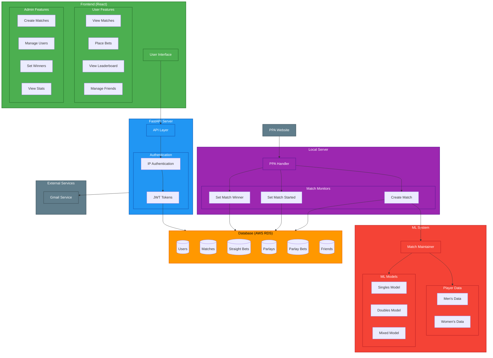
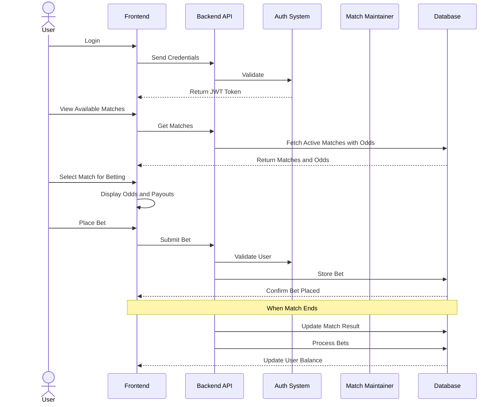
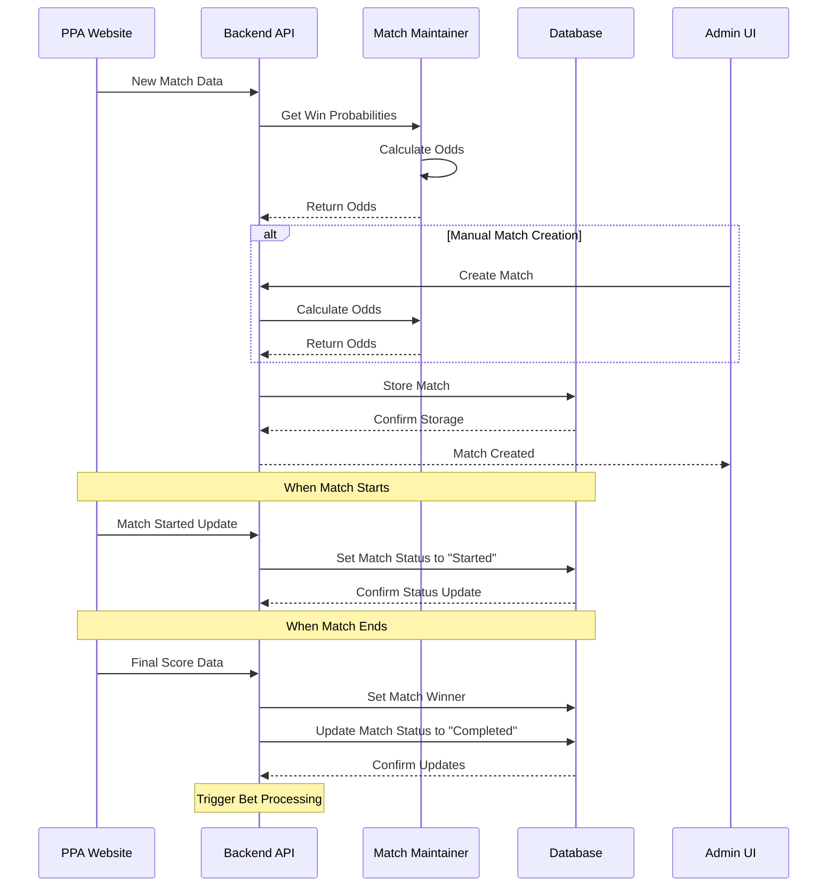
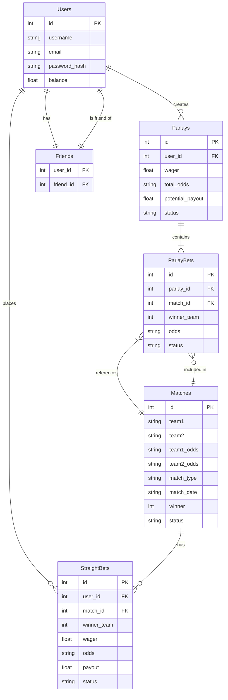

# Pickleball-Picks Project Flows

## 1. System Architecture

```mermaid
graph TB
    subgraph Frontend ["Frontend (React)"]
        direction TB
        UI[User Interface]
        subgraph UserFeatures ["User Features"]
            ViewMatches[View Matches]
            PlaceBets[Place Bets]
            ViewLeaderboard[View Leaderboard]
            ManageFriends[Manage Friends]
        end
        subgraph AdminFeatures ["Admin Features"]
            CreateMatches[Create Matches]
            ManageUsers[Manage Users]
            SetWinners[Set Winners]
            ViewStats[View Stats]
        end
    end

    subgraph RenderServer ["FastAPI Server"]
        direction TB
        API[API Layer]
        subgraph Auth ["Authentication"]
            IPAuth[IP Authentication]
            JWT[JWT Tokens]
        end
    end

    subgraph LocalServer ["Local Server"]
        direction TB
        PPAHandler[PPA Handler]
        subgraph Monitors ["Match Monitors"]
            CreateMatch[Create Match]
            SetStarted[Set Match Started]
            SetWinner[Set Match Winner]
        end
    end

    subgraph Database ["Database (AWS RDS)"]
        direction TB
        Users[(Users)]
        Matches[(Matches)]
        StraightBets[(Straight Bets)]
        Parlays[(Parlays)]
        ParlayBets[(Parlay Bets)]
        Friends[(Friends)]
    end

    subgraph ML ["ML System"]
        direction TB
        MatchMaintainer[Match Maintainer]
        subgraph Data ["Player Data"]
            MenData[Men's Data]
            WomenData[Women's Data]
        end
        subgraph Models ["ML Models"]
            Singles[Singles Model]
            Doubles[Doubles Model]
            Mixed[Mixed Model]
        end
    end

    subgraph External ["External Services"]
        Gmail[Gmail Service]
    end

    PPA[PPA Website]

    %% Frontend to Production Server Connections
    UI --> API
    API --> IPAuth
    IPAuth --> JWT
    JWT --> Database

    %% Local Server Connections
    PPA --> PPAHandler
    PPAHandler --> CreateMatch
    PPAHandler --> SetStarted
    PPAHandler --> SetWinner
    CreateMatch --> MatchMaintainer
    CreateMatch --> Database
    SetStarted --> Database
    SetWinner --> Database

    %% Email Service Connection
    RenderServer --> Gmail

    %% ML System Connections
    MatchMaintainer --> Data
    MatchMaintainer --> Models

    classDef frontend fill:#4CAF50,stroke:#2E7D32,stroke-width:2px,color:#FFFFFF
    classDef renderserver fill:#2196F3,stroke:#1565C0,stroke-width:2px,color:#FFFFFF
    classDef localserver fill:#9C27B0,stroke:#6A1B9A,stroke-width:2px,color:#FFFFFF
    classDef database fill:#FF9800,stroke:#EF6C00,stroke-width:2px,color:#000000
    classDef ml fill:#F44336,stroke:#C62828,stroke-width:2px,color:#FFFFFF
    classDef external fill:#607D8B,stroke:#455A64,stroke-width:2px,color:#FFFFFF

    class Frontend,UI,UserFeatures,AdminFeatures frontend
    class RenderServer,API,Auth renderserver
    class LocalServer,PPAHandler,Monitors localserver
    class Database database
    class ML,MatchMaintainer,Data,Models ml
    class External,Gmail,PPA external
```

## 2. Betting Flow

```mermaid
sequenceDiagram
    actor User
    participant UI as Frontend
    participant API as Backend API
    participant Auth as Auth System
    participant ML as Match Maintainer
    participant DB as Database

    User->>UI: Login
    UI->>API: Send Credentials
    API->>Auth: Validate
    Auth-->>UI: Return JWT Token

    User->>UI: View Available Matches
    UI->>API: Get Matches
    API->>DB: Fetch Active Matches with Odds
    DB-->>UI: Return Matches and Odds

    User->>UI: Select Match for Betting
    UI->>UI: Display Odds and Payouts

    User->>UI: Place Bet
    UI->>API: Submit Bet
    API->>Auth: Validate User
    API->>DB: Store Bet
    DB-->>UI: Confirm Bet Placed

    Note over UI,DB: When Match Ends
    API->>DB: Update Match Result
    API->>DB: Process Bets
    DB-->>UI: Update User Balance
```

## 3. Match Creation Flow

```mermaid
sequenceDiagram
    participant PPA as PPA Website
    participant API as Backend API
    participant ML as Match Maintainer
    participant DB as Database
    participant Admin as Admin UI

    %% Match Creation
    PPA->>API: New Match Data
    API->>ML: Get Win Probabilities
    ML->>ML: Calculate Odds
    ML-->>API: Return Odds

    alt Manual Match Creation
        Admin->>API: Create Match
        API->>ML: Calculate Odds
        ML-->>API: Return Odds
    end

    API->>DB: Store Match
    DB-->>API: Confirm Storage
    API-->>Admin: Match Created

    %% Match Start
    Note over PPA,DB: When Match Starts
    PPA->>API: Match Started Update
    API->>DB: Set Match Status to "Started"
    DB-->>API: Confirm Status Update

    %% Match End
    Note over PPA,DB: When Match Ends
    PPA->>API: Final Score Data
    API->>DB: Set Match Winner
    API->>DB: Update Match Status to "Completed"
    DB-->>API: Confirm Updates
    Note over API: Trigger Bet Processing
```

## 4. Database Schema

```mermaid
erDiagram
    %% Core Entities
    Users {
        int id PK
        string username
        string email
        string password_hash
        float balance
    }

    Matches {
        int id PK
        string team1
        string team2
        string team1_odds
        string team2_odds
        string match_type
        string match_date
        int winner
        string status
    }

    %% Betting Entities
    StraightBets {
        int id PK
        int user_id FK
        int match_id FK
        int winner_team
        float wager
        string odds
        float payout
        string status
    }

    Parlays {
        int id PK
        int user_id FK
        float wager
        string total_odds
        float potential_payout
        string status
    }

    ParlayBets {
        int id PK
        int parlay_id FK
        int match_id FK
        int winner_team
        string odds
        string status
    }

    %% Social Entity
    Friends {
        int user_id FK
        int friend_id FK
    }

    %% Relationships
    Users ||--o{ StraightBets : "places"
    Users ||--o{ Parlays : "creates"
    Users ||--|| Friends : "has"
    Friends ||--|| Users : "is friend of"
    
    Matches ||--o{ StraightBets : "has"
    Matches ||--o{ ParlayBets : "included in"
    
    Parlays ||--|{ ParlayBets : "contains"
    ParlayBets }|--|| Matches : "references"
```

[Rest of the file remains unchanged...] 